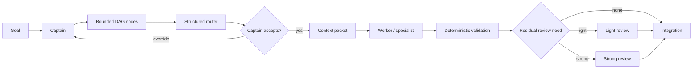

# Adaptive agent routing

> **Human documentation.** The executable agent contract lives in [`SKILL.md`](./SKILL.md).

## What this skill does

`adaptive-agent-routing` is a scheduling and context-allocation skill for large or heterogeneous agentic work. It helps a broad-context captain decide how each bounded task should be executed without defaulting every node to the strongest model, the largest context window, or an expensive reviewer.

The skill separates four responsibilities:

- the **captain** understands the overall goal, repository, architecture, and integration state;
- a **structured router** classifies bounded tasks using closed-set dimensions such as difficulty, risk, blast radius, context scope, and review need;
- **workers** execute narrow contracts with minimum sufficient context;
- **reviewers** inspect residual risk after deterministic validation.

The router recommends. The captain remains the semantic and authorization authority.

## Why it exists

Agentic systems often waste capability in two opposite ways. They can over-route simple work to expensive models with giant prompts, or under-route risky work because every subtask is treated as an interchangeable unit.

This skill tries to make routing proportional. A three-line destructive migration can deserve more scrutiny than a 500-line isolated UI component. A deterministic parser may need no model at all. A cheap worker can be perfectly adequate for a mechanical edit while the resulting change still deserves a strong independent review because the blast radius is high.

The goal is not to minimize cost at any price. The goal is to spend context and reasoning where they materially improve the expected outcome.

## When to use it

Use this skill when a goal has multiple bounded nodes and those nodes differ meaningfully in complexity, risk, specialist depth, context needs, or review requirements.

Typical examples include:

- a repository-wide feature that mixes UI, API, database, and verification work;
- a research/enrichment pipeline with deterministic and semantic stages;
- a refactor where some edits are mechanical and others are architectural;
- a project that can safely run independent workers in parallel;
- a workflow where strong-model usage should be justified rather than automatic.

Do not use it for a tiny local edit, one already-bounded worker task, or as a substitute for release authorization.

## How it works

The normal sequence is:

1. the captain decomposes the goal before routing;
2. the router classifies each node with a closed vocabulary;
3. the captain accepts or overrides the route using repository knowledge;
4. the captain materializes the abstract context decision into actual files, excerpts, tests, and invariants;
5. a bounded worker executes the node;
6. deterministic checks run before semantic review;
7. review strength is chosen independently from worker strength;
8. the captain integrates the result and records routing outcomes for later calibration.

The canonical routing dimensions and worker/reviewer tiers are documented in [`references/routing-contract.md`](./references/routing-contract.md). Context construction is documented in [`references/context-packet.md`](./references/context-packet.md).

## Expected inputs

A useful routing decision needs a bounded task descriptor rather than an entire repository dump. The captain should know, as far as practical:

- the node objective and observable acceptance criteria;
- likely owning files or interfaces;
- dependencies and shared contracts;
- risk and side-effect boundaries;
- available deterministic checks;
- specialist requirements;
- the available worker/reviewer capability tiers.

Secrets, full private conversation history, unrelated files, and arbitrary external instructions do not belong in the router input.

## Expected results

A successful use of this skill produces an auditable route for each relevant node, including:

- task classification and risk dimensions;
- selected context scope and budget;
- worker capability tier and specialist role when needed;
- safe parallelism decision;
- deterministic-validation expectation;
- independent-review route after validation;
- captain acceptance, override, or escalation state;
- enough telemetry to discover systematic over-routing or under-routing later.

The expected result is **not** merely “a stronger model answered the task.” The result should show why the selected route was proportionate and what evidence supports the final outcome.

## Example

Suppose a feature requires three nodes:

- update a localization label using an existing component;
- add an additive database migration;
- build a complex interactive 3D visualization.

A reasonable route might use a light worker with micro context for the label, a captain-level or strong worker with strong review for the migration, and a specialist/strong worker with a larger curated packet for the 3D task. The three nodes belong to the same parent goal but should not inherit the same model, effort, context, or review policy.

## Specific design choices

This skill deliberately separates several decisions that are often collapsed together:

- **difficulty is not risk**;
- **worker strength is not reviewer strength**;
- **context scope is not raw token count**;
- **parallelizable does not mean “spawn more agents”**;
- **router confidence does not override repository evidence**;
- **model availability is not a reason to escalate**.

A structured router such as Jev is a good fit because the routing questions are bounded and auditable, but the skill is provider-neutral. Capability tiers remain stable even when model names change.

## Works well with

- [`orchestrated-delivery`](../orchestrated-delivery/README.md) for integration, review, and external-effect gates;
- [`engineering-verification`](../engineering-verification/README.md) for deterministic evidence before review;
- [`security-review`](../security-review/README.md) when a routed node crosses security boundaries;
- [`frontend-design`](../frontend-design/README.md) for specialist UI, motion, or 3D work.

## Limitations

This skill does not decide what the product should be, does not replace repository understanding, and does not authorize commits, merges, deploys, or production mutation.

A bad task decomposition produces bad routing. A router cannot recover architecture that was never surfaced to it. Calibration also requires a real sample of outcomes; one successful task is not enough evidence to hardcode a new routing policy.

## Agent contract

For exact triggers, invariants, result states, routing vocabulary, escalation rules, and handoff fields, read [`SKILL.md`](./SKILL.md). That file is the operational source of truth for agents.
