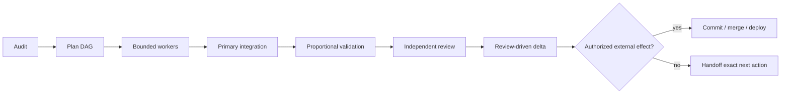

# Orchestrated delivery

> **Human documentation.** The executable agent contract lives in [`SKILL.md`](./SKILL.md).

## What this skill does

`orchestrated-delivery` is a delivery workflow for software changes that are too large for one casual edit but still bounded enough to execute safely. It defines who owns planning, which work may be delegated, how worker output is integrated, what evidence is required before completion, and where user authorization is required for external effects.

The central idea is accountability: workers can execute isolated nodes, but the primary agent remains responsible for scope, architecture, integration, validation, review, and release boundaries.

## Why it exists

Multi-agent work can look productive while hiding serious gaps. Workers may overlap, overwrite dirty changes, report tests they did not run, or each produce locally correct patches that fail when combined. A successful worker report is also not the same thing as an independently reviewed release.

This skill turns delegation into a controlled delivery pipeline rather than a pile of parallel edits.

## When to use it

Use it when a bounded software change needs several coordinated steps or workers and the final result must be supported by explicit evidence.

Good examples include:

- a feature spanning multiple modules;
- an implementation split across independent work packages;
- a refactor with integration-sensitive boundaries;
- a change that requires independent review before release;
- a task where commit, push, merge, deploy, or production mutation must remain behind explicit authorization.

Do not use it for a tiny local edit, pure architecture discovery, or as a way to bypass authorization for a production operation.

## How it works

The workflow has eight stages:

1. audit repository instructions, worktree state, target paths, and authorization boundaries;
2. convert the request into a DAG with explicit owners, dependencies, write sets, and acceptance checks;
3. give each worker one self-contained work order;
4. inspect and integrate worker changes in the primary worktree;
5. validate proportionally to the affected surface and risk;
6. request an independent review over the integrated diff and evidence;
7. apply only the smallest review-driven delta and revalidate it;
8. perform commit/push/merge/deploy only when that specific external effect is authorized.

## Expected inputs

The primary owner should have:

- a bounded objective;
- observable acceptance criteria;
- repository instructions and current branch/worktree state;
- the relevant execution path or enough evidence to discover it;
- known authorization limits;
- available validation tooling;
- worker and reviewer capabilities if delegation is in scope.

Dirty or pre-existing changes are inputs, not clutter to erase. They must be identified and preserved.

## Expected results

A successful run produces more than code. It produces a delivery record showing:

- baseline and scope inspected;
- worker nodes and ownership boundaries;
- integrated files and preserved pre-existing changes;
- exact validation commands and result states;
- independent review outcome;
- review-driven corrections and revalidation;
- external effects that were authorized and actually performed;
- unresolved risks or blockers.

The package-standard validation states are `PASS`, `FAIL`, `NOT_RUN`, and `BLOCKED_EXTERNAL`. `APPROVE` is reserved for an independent review gate.

## Example

Imagine a feature that needs an API endpoint, a UI component, and tests. The API and UI can be delegated if their write sets and contracts are clear. Each worker runs focused checks and reports evidence. The primary agent then inspects both diffs, integrates them, runs cross-boundary tests, and gives a fresh reviewer the combined change. Only after required checks pass and the review approves does the workflow cross into an authorized merge or deploy.

The key difference from “three agents worked on it” is that the integrated state — not each isolated worker state — is what gets validated and reviewed.

## Specific design choices

This skill intentionally enforces a few boundaries:

- workers do not decide that the whole task is complete;
- worker reports are not treated as proof without primary inspection;
- passing local checks do not prove integrated behavior;
- a material post-review delta invalidates the prior approval for that surface;
- external effects are separate authorization decisions;
- dirty worktrees are preserved instead of reset for convenience;
- failed or unavailable checks remain visible rather than being inferred green.

## Works well with

- [`adaptive-agent-routing`](../adaptive-agent-routing/README.md) to choose proportionate workers, context, and reviewers for DAG nodes;
- [`engineering-verification`](../engineering-verification/README.md) to design the evidence plan;
- [`debugging`](../debugging/README.md) when a node is a root-cause investigation;
- [`security-review`](../security-review/README.md) for security-sensitive integration surfaces.

## Limitations

This skill does not invent missing acceptance criteria, make an unsafe change safe by adding more reviewers, or grant production authority. It also should not turn every medium-sized task into a bureaucratic ceremony: validation and review are proportional to the actual risk and scope.

If ownership cannot be established, if two workers overlap without a clear owner, or if a requested action crosses an unauthorized destructive/security/production boundary, the correct result is a stop with evidence rather than forced progress.

## Agent contract

For exact ownership roles, result-state semantics, stop conditions, delivery sequence, and the required handoff record, read [`SKILL.md`](./SKILL.md). That file is the operational source of truth for agents.
