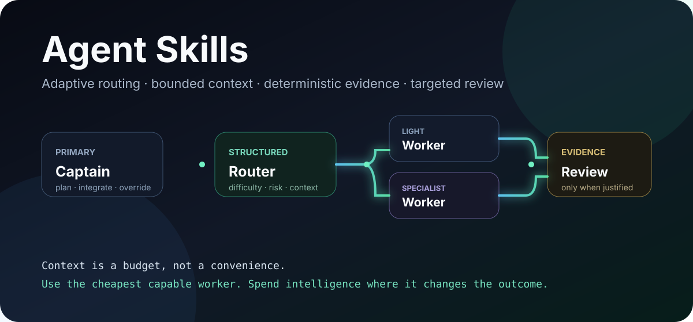
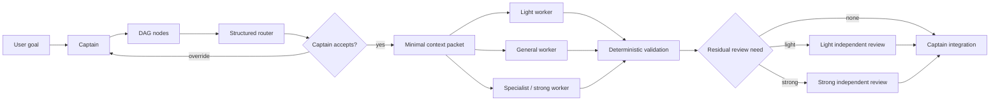

<div align="center">
  

  <br />
  <br />

  <a href="https://github.com/kynn-dev/agent-skills/actions/workflows/validate-skills.yml"></a>
  <a href="./LICENSE"></a>
  
  
  <a href="https://github.com/kynn-dev/agent-skills/stargazers"></a>

  <h3>Reusable agent skills for people who want agents to act less like one giant prompt<br/>and more like a well-run engineering team.</h3>

  <p>
    Adaptive routing · multi-agent orchestration · evidence-first debugging · engineering verification · security review · frontend design · human copywriting
  </p>
</div>

---

## Why this exists

A big task does **not** imply that every subtask deserves the biggest model, the largest context window, or an expensive independent review.

A CSS tweak, an additive database migration, a 3D rendering task, and an authentication boundary are different jobs. Treating them as the same job wastes context and compute — and can make review worse by burying the important evidence under unrelated history.

This repository packages the workflows we use to make agentic work more deliberate:

```text
broad-context captain
        ↓
    decompose DAG
        ↓
structured task routing
        ↓
minimal context packets
        ↓
bounded workers / specialists
        ↓
deterministic validation
        ↓
targeted independent review
        ↓
captain integration + gates
```

The core idea is simple:

> **Use the cheapest capable worker. Give it the minimum sufficient context. Spend stronger reasoning on the places where it can actually change the outcome.**

---

## Featured skills

<table>
<tr>
<td width="50%" valign="top">

### 🧠 `adaptive-agent-routing`

A scheduler for heterogeneous agent work.

It routes bounded DAG nodes by:

- semantic difficulty;
- risk and blast radius;
- reversibility;
- specialist depth;
- context scope and budget;
- worker capability tier;
- review strength;
- safe parallelism.

The router recommends. The captain keeps veto power.

**Best part:** worker routing and reviewer routing are separate decisions.

[Read the skill →](./.agents/skills/adaptive-agent-routing/SKILL.md)

</td>
<td width="50%" valign="top">

### ✍️ `human-copywriting`

Copy that does not try to win a fight with adjectives.

It separates:

- confirmed facts;
- voice and intent;
- creative language;
- claims that still need sources;
- unknowns that must stay unknown.

Useful for landing pages, product copy, UX text, scripts, emails, case studies, and editing that should still sound like the original human.

[Read the skill →](./.agents/skills/human-copywriting/SKILL.md)

</td>
</tr>
</table>

---

## The public package

| Skill | What it is for |
| --- | --- |
| [`adaptive-agent-routing`](./.agents/skills/adaptive-agent-routing/SKILL.md) | Route workers, context, parallelism, and reviewers according to task difficulty and risk. |
| [`orchestrated-delivery`](./.agents/skills/orchestrated-delivery/SKILL.md) | Run a bounded multi-agent change from audit → DAG → integration → review → authorized external effects. |
| [`skill-authoring`](./.agents/skills/skill-authoring/SKILL.md) | Build skills with useful trigger boundaries, progressive disclosure, resources, and activation tests. |
| [`debugging`](./.agents/skills/debugging/SKILL.md) | Reproduce first, form a falsifiable hypothesis, isolate the boundary, then make the smallest correction. |
| [`engineering-verification`](./.agents/skills/engineering-verification/SKILL.md) | Turn “looks good” into fresh, scoped evidence with explicit PASS / FAIL / NOT_RUN / BLOCKED_EXTERNAL states. |
| [`security-review`](./.agents/skills/security-review/SKILL.md) | Threat-model and review auth, tenant isolation, secrets, input/output boundaries, SSRF, supply chain, and deployment without weakening controls. |
| [`frontend-design`](./.agents/skills/frontend-design/SKILL.md) | Design and implement product-grounded UI with explicit responsive, accessibility, visual-evidence, and specialist-motion/3D boundaries. |
| [`human-copywriting`](./.agents/skills/human-copywriting/SKILL.md) | Write/edit natural copy while keeping factual claims tied to evidence and preserving voice. |
| [`brand-aware-design`](./.agents/skills/brand-aware-design/SKILL.md) | Separate confirmed brand evidence from reversible creative decisions, unknowns, and conflicts. |

This repository is an **allowlisted public export**. Private project instructions and project-specific brand-direction skills are deliberately not mirrored here.

---

## Adaptive routing in one picture



A structured router can be something cheap and auditable such as **Jev**. It should classify a bounded descriptor — not read the whole repository, choose arbitrary commands, or become the factual authority.

The captain owns repository semantics and resolves the router's abstract decisions into real files and context.

See:

- [routing decision contract](./.agents/skills/adaptive-agent-routing/references/routing-contract.md)
- [context packet construction](./.agents/skills/adaptive-agent-routing/references/context-packet.md)
- [routing calibration](./.agents/skills/adaptive-agent-routing/references/calibration.md)
- [OpenAI + Jev example mapping](./.agents/skills/adaptive-agent-routing/references/openai-jev-example.md)

---

## Context is a budget

A worker should not automatically inherit the captain's entire universe.

| Budget | Typical use |
| --- | --- |
| `micro` | One tiny bounded edit; roughly 1–4k useful tokens |
| `small` | A few directly related files/interfaces; roughly 4–12k |
| `medium` | A module + tests/contracts; roughly 12–30k |
| `large` | Complex subsystem/specialist task; roughly 30–80k |
| `broad` | Exceptional captain-curated context when narrower packets demonstrably fail |

These are planning classes, not tokenizer quotas.

A good worker packet usually contains:

```text
ROLE
OBJECTIVE
ACCEPTANCE_CRITERIA
ALLOWED_SCOPE
RELEVANT_CONTEXT
DEPENDENCIES
INVARIANTS
PROHIBITED_SIDE_EFFECTS
VALIDATION
OUTPUT_CONTRACT
```

That is usually better than forwarding a 10k-token parent goal plus an entire repository history to someone whose job is to change one component.

---

## Installation

### Repository-scoped skills

Copy the skills you want into your repository's `.agents/skills/` directory:

```text
my-project/
└── .agents/
    └── skills/
        ├── adaptive-agent-routing/
        │   ├── SKILL.md
        │   └── references/
        └── engineering-verification/
            └── SKILL.md
```

### Clone the whole package

```bash
git clone https://github.com/kynn-dev/agent-skills.git
cd agent-skills
python -B tools/validate_skills.py .
```

Then copy only the skill directories appropriate to your project. Loading every skill into every repository is usually worse than selecting the smallest useful profile.

---

## Profiles

The machine-readable [`skills-package.json`](./skills-package.json) groups the current public skills into small profiles:

```text
core
├── adaptive-agent-routing
├── orchestrated-delivery
├── skill-authoring
├── debugging
├── engineering-verification
└── security-review

orchestration
├── adaptive-agent-routing
├── orchestrated-delivery
└── engineering-verification

creative
├── human-copywriting
├── brand-aware-design
└── frontend-design

frontend
├── frontend-design
├── brand-aware-design
├── human-copywriting
└── engineering-verification
```

---

## Design principles

### 1. Stronger is not automatically better

The strongest model should not spend its day changing padding, reading deterministic logs, or scanning every file in a repository.

### 2. Deterministic checks go first

If a test, parser, query, checksum, schema validator, or reconciliation script can answer the question, let it answer before paying for semantic review.

### 3. Review residual risk

Independent review should receive a compact evidence bundle and challenge what remains uncertain after deterministic validation.

### 4. Preserve uncertainty

`NOT_RUN` is not `PASS`. `BLOCKED_EXTERNAL` is not a reason to invent runtime evidence. An unsupported claim is not fixed by confident prose.

### 5. Captains integrate; routers recommend

Cheap routing is useful precisely because it is bounded. A router should not silently become architect, repository historian, security authority, and release owner.

### 6. Calibrate with outcomes

Track overrides, repair cycles, reviewer findings, context classes, latency, and cost. Tune the routing policy from a real sample — not from one impressive demo.

---

## Validation

The repository ships a dependency-free validator:

```bash
python -B tools/validate_skills.py .
```

It checks the public package for:

- skill directory / frontmatter name alignment;
- trigger + exclusion boundaries;
- broken local links;
- known private-project markers across public text files;
- package/profile/version consistency;
- basic package structure.

GitHub Actions runs the same validator on pull requests and pushes to `main`.

A green structural validator does **not** prove that a skill routes perfectly. Real activation and behavior still need realistic evaluation cases — which is why [`skill-authoring`](./.agents/skills/skill-authoring/SKILL.md) treats those as a separate gate.

---

## Public-safety boundary

This repository intentionally contains only skills approved for public reuse.

It does **not** include:

- private client/project context;
- internal brand-direction profiles;
- credentials, tokens, environment values, private endpoints, or personal data;
- application code from the projects where these workflows were developed.

The public package is maintained as an allowlist, not as “copy everything and try to delete the private bits later.”

---

## Contributing

Contributions are welcome — especially improvements that make a skill easier to route, more evidence-oriented, less wasteful with context, or easier to evaluate.

Read [CONTRIBUTING.md](./CONTRIBUTING.md) before opening a PR.

Security/privacy issues should follow [SECURITY.md](./SECURITY.md), not a public issue containing sensitive details.

---

## License

MIT. See [LICENSE](./LICENSE).

<div align="center">
  <br />
  <strong>Spend intelligence where it changes the outcome.</strong>
  <br /><br />
  If this repository saves you a few million unnecessary tokens, consider leaving a ⭐.
</div>
